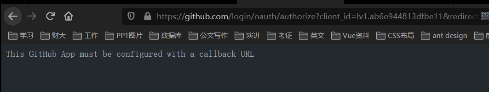
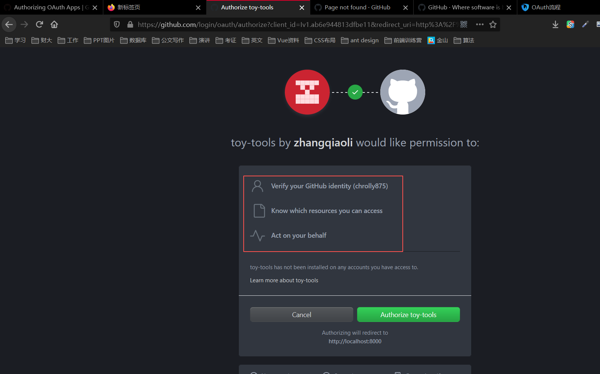
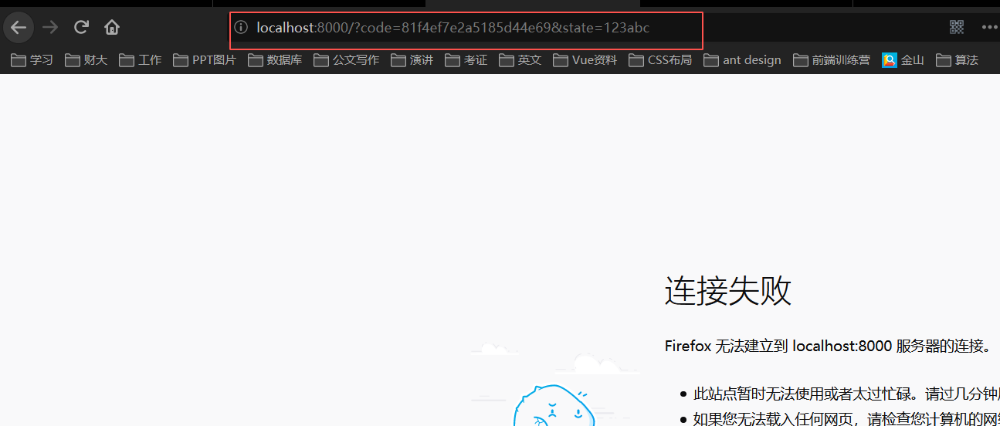
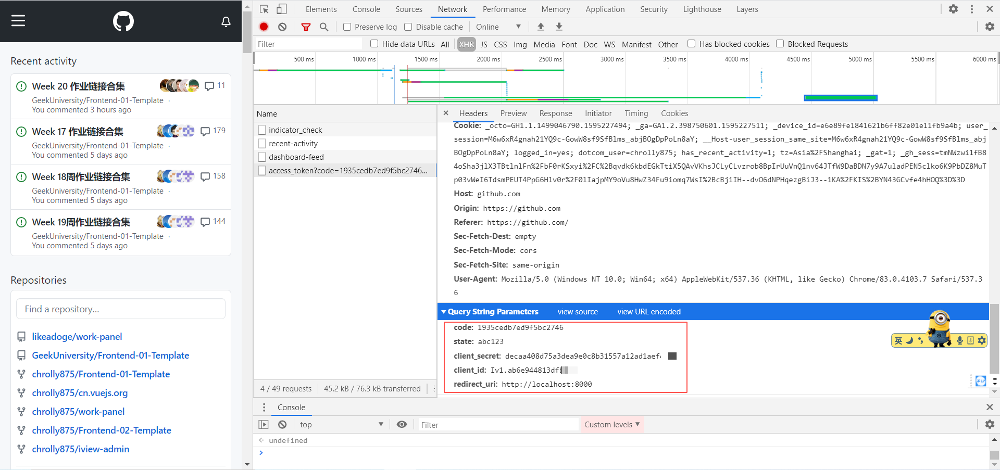
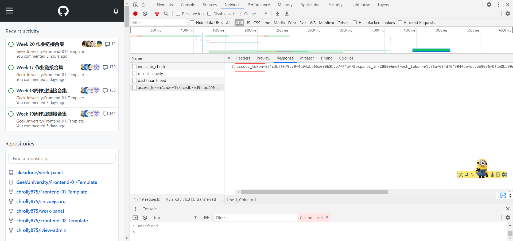
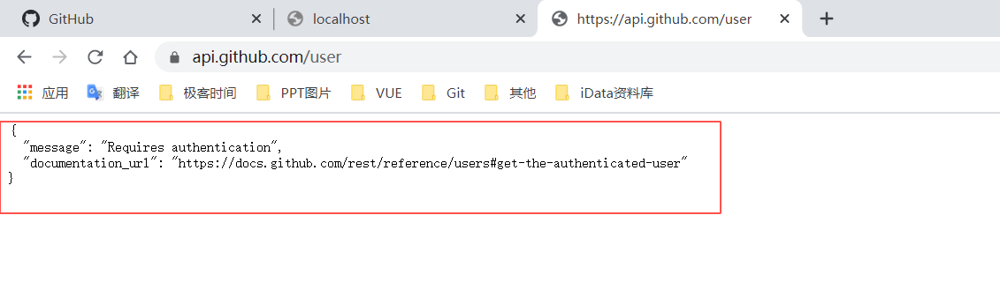
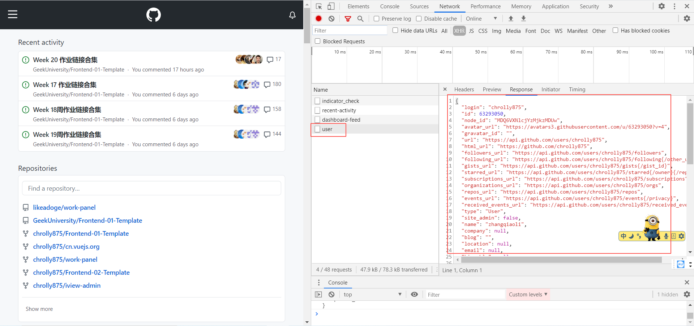

# 每周总结可以写在这里

## 发布系统 | lint 与 PhantomJS

- PhantomJS
  持续集成
  单元测试
- JSLint

## 发布系统 | OAuth

拿code去换token

API认证

## 参考链接

- [PhantomJS 下载地址](https://phantomjs.org/download)
- <https://developer.github.com/v3/>
- [OAuth](https://justauth.wiki/#/quickstart/oauth)
